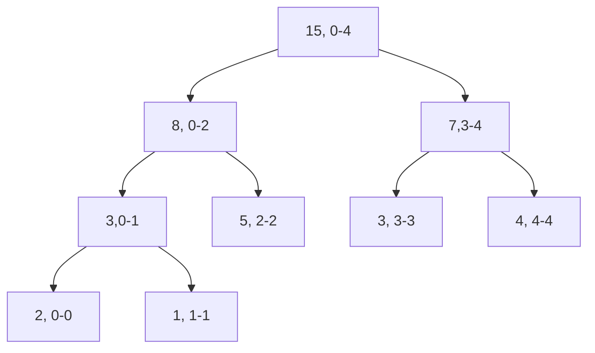

# Segment Tree

- balance binary tree. `O(logN)` height given n elements.

## Example

```csharp
var nums = new int[] {2,1,5,3,4}
```



## Operations

1. build(`O(N)`)
1. update(`O(logN)`)
1. range query(`O(logN + k)`), k: number of reported segments
