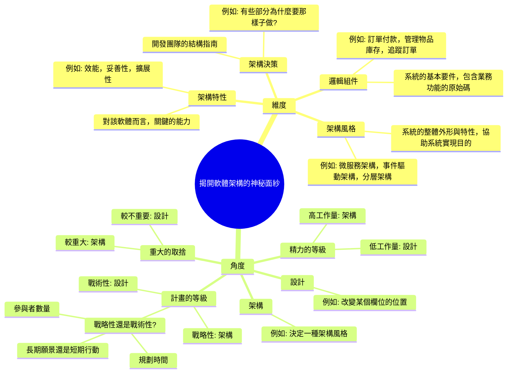

# Chapter 1: Software Architecture Demystified

```mermaid
mindmap
  root((揭開軟體架構的神秘面紗))
    維度
        架構特性
            對該軟體而言，關鍵的能力
            例如: 效能，妥善性，擴展性
        架構決策
            開發團隊的結構指南
            例如: 有些部分為什麼要那樣子做?
        邏輯組件
            系統的基本要件，包含業務功能的原始碼
            例如: 訂單付款，管理物品庫存，追蹤訂單
        架構風格
            系統的整體外形與特性，協助系統實現目的
            例如: 微服務架構，事件驅動架構，分層架構
    角度
        設計
            例如: 改變某個欄位的位置
        架構
            例如: 決定一種架構風格
        計畫的等級
            戰略性還是戰術性?
                規劃時間
                參與者數量
                長期願景還是短期行動
            戰略性: 架構
            戰術性: 設計
        精力的等級
            高工作量: 架構
            低工作量: 設計
        重大的取捨
            較重大: 架構
            較不重要: 設計
```
