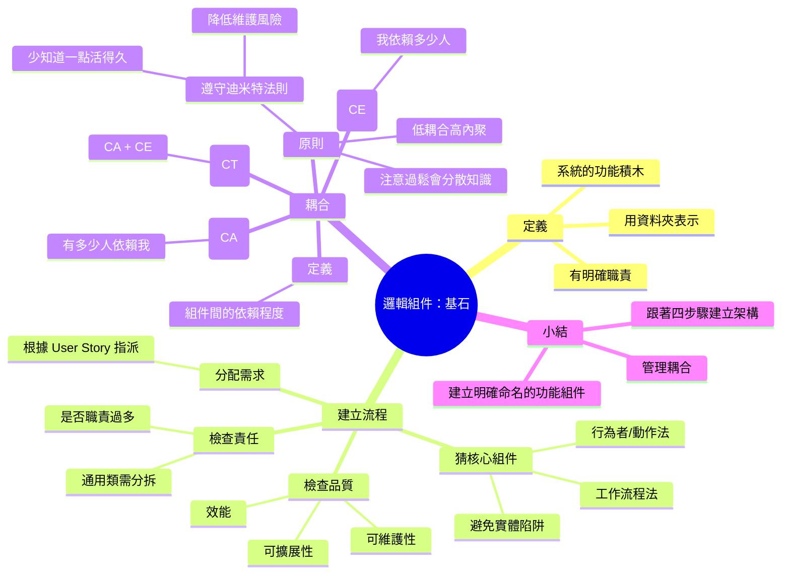
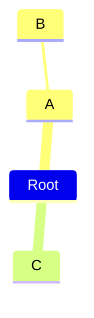
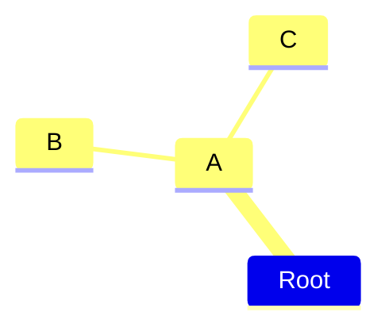

```mermaid
mindmap
  root((邏輯組件：基石))
    定義
      系統的功能積木
      用資料夾表示
      有明確職責
    建立流程
      猜核心組件
        工作流程法
        行為者/動作法
        避免實體陷阱
      分配需求
        根據 User Story 指派
      檢查責任
        是否職責過多
        通用類需分拆
      檢查品質
        效能
        可維護性
        可擴展性
    耦合
      定義
        組件間的依賴程度
      傳入耦合(CA)
        有多少人依賴我
      傳出耦合(CE)
        我依賴多少人
      總耦合(CT)
        CA + CE
      原則
        低耦合高內聚
        遵守迪米特法則
          少知道一點活得久
          降低維護風險
        注意過鬆會分散知識
    小結
      建立明確命名的功能組件
      跟著四步驟建立架構
      管理耦合
```

```mermaid
mindmap
    Root
        A
            B
        C
```

```mermaid
mindmap
Root
    A
      B
      C
```