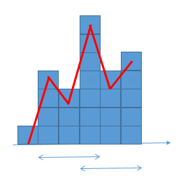

# Monotonous Stack

## 簡介

- stack中保持著一定的順序，例如遞增或是遞減。

## 使用時機

1. 需要`往前`或是`往後`尋找，`下一個比自己大或比自己小`的元素就可以使用monotonic stack
   1. PLE(Previous Less Element)
      - 找出 `之前` 比自己還小的值。
      - stack 存放 index，有很多好處，其中之一就是可以算和 target 的差距。
      - 如果 stack 為空則填入 0

        ```csharp
        int[] nums;
        int[] ple = new int[nums.Length];
        Stack<int> st = new();
        for(int i = 0; i < nums.Length; ++i){
            while(st.Count > 0 && nums[st.Peek()] > nums[i]) 
                st.Pop(); // pop 不要的，意指一樣的也會算到
            ple[i] = st.Count == 0 ? -1 : st.Peek();
            st.Push(i);
        }
        ```

   2. NLE(Next Less Element)
      - 找出 `之後` 比自己還小的值
      - 如果 stack 為空，則填入 nums.Length

        ```csharp
        int[] nums;
        int[] nle = new int[nums.Length];
        Stack<int> st = new();
        for(int i = nums.Length - 1; i >= 0; --i){
            while(st.Count > 0 && nums[st.Peek()] > nums[i]) 
                st.Pop();
            nle[i] = st.Count == 0 ? nums.Length : st.Peek();
            st.Push(i);
        }
        ```

      - 另一種寫法，如果沒有辦法從後面走訪數列的話

         ```csharp
         int[] nums;
         int[] nle = new int[nums.Length];
         Array.Fill(nle, nums.Length);
         Stack<int> st = new();
         for(int i = 0; i < nums.Length; ++i){
             while(st.Count > 0 && nums[st.Peek()] > nums[i])
                 nle[st.Pop()] = i;
             st.Push(i);
         }
         ```

   3. PGE(Previous Greater Element)

        ```csharp
        int[] nums;
        int[] pge = new int[nums.Length];
        Stack<int> st = new();
        for(int i = 0; i < nums.Length; ++i){
            while(st.Count > 0 && nums[st.Peek()] < nums[i]) 
                st.Pop();
            pge[i] = st.Count == 0 ? -1 : st.Peek();
            st.Push(i);
        }
        ```

   4. NLE(Next Greater Element)

        ```csharp
        int[] nums;
        int[] nge = new int[nums.Length];
        Stack<int> st = new();
        for(int i = nums.Length - 1; i >= 0; --i){
            while(st.Count > 0 && nums[st.Peek()] < nums[i]) 
                st.Pop();
            nge[i] = st.Count == 0 ? nums.Length : st.Peek();
            st.Push(i);
        }
        ```

2. 往前或是往後看的最大/小值
   1. 往前看的最大值，如果自己是最大值，則是自己

        ```csharp
        int[] nums;
        int maxi = -1;
        int[] backwardMax = new int[nums.Length];
        for(int i = 0; i < nums.Length; ++i) {
            if(maxi == -1 || nums[i] >= nums[maxi])
                maxi = i;
            backwardMax[i] = maxi;
        }
        ```

   2. 往後看的最大值，如果自己是最大值，則是自己

        ```csharp
        int[] nums;
        int maxi = nums.Length;
        int[] forwardMax = new int[nums.Length];
        for(int i = nums.Length - 1; i >= 0; --i) {
            if(maxi == nums.Length || nums[i] >= nums[maxi])
                maxi = i;
            forwardMax[i] = maxi;
        }
        ```

   - Practice
     - [0042. Trapping Rain Water](https://leetcode.com/problems/trapping-rain-water/)
     - [0739. Daily Temperatures[Medium]](https://leetcode.com/problems/daily-temperatures/)
     - [0901. Online Stock Span](https://leetcode.com/problems/online-stock-span)

3. 找出以第i個位置的山峰或是山谷
   - 應用前面的找出前面和後面比自己高或是比自己低的位置，如果左右邊都應用的話，就是找出以第i個位置的山峰或是山谷。
例如: [1,4,3,7,4,5]，可以畫出以下的圖
   - 
   - Practice
     - [1793. Maximum Score of a Good Subarray](https://leetcode.com/problems/maximum-score-of-a-good-subarray)
     - [0084. Largest Rectangle in Histogram](https://leetcode.com/problems/largest-rectangle-in-histogram/)
     - [0907. Sum of Subarray Minimums](https://leetcode.com/problems/sum-of-subarray-minimums)
     - [0316. Remove Duplicate Letters](https://leetcode.com/problems/remove-duplicate-letters)
     - [2866. Beautiful Towers II](https://leetcode.com/problems/beautiful-towers-ii)
     - [1944. Number of Visible People In a Queue](https://leetcode.com/problems/number-of-visible-people-in-a-queue)

    1. ref: <https://hackmd.io/@meyr543/rkjS-x6wY>
