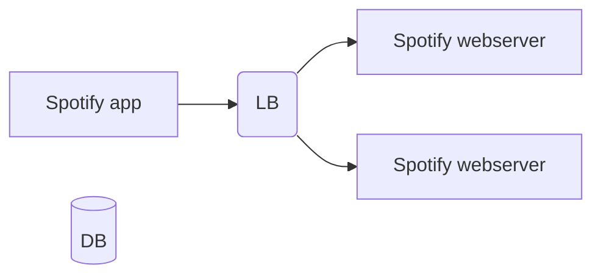
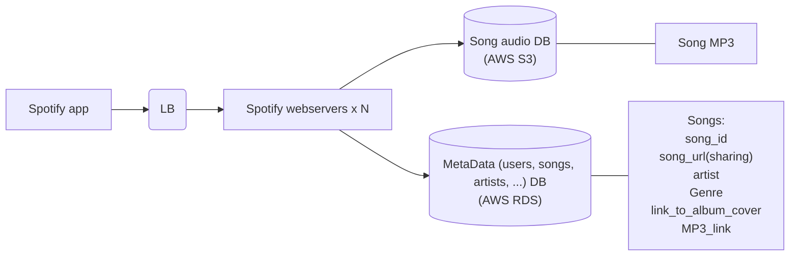
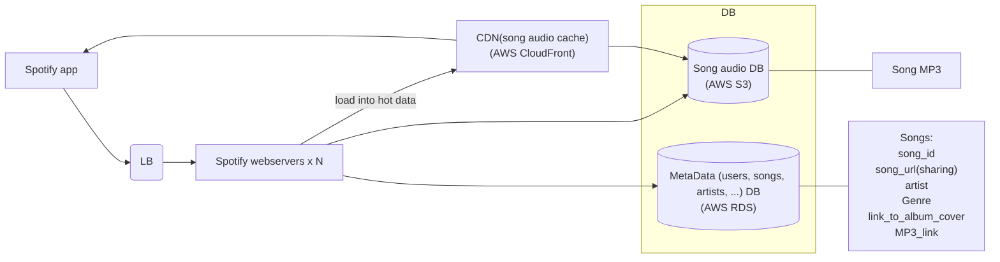
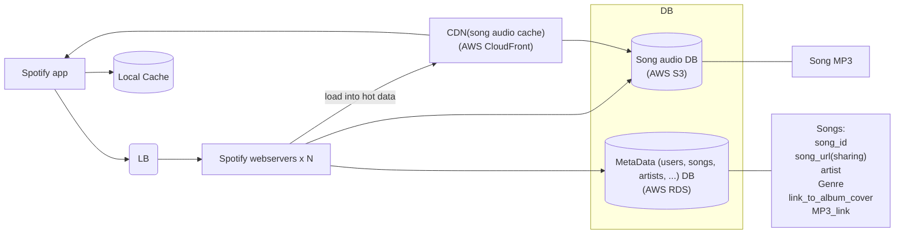

# Design Spotify

## 1. Clarify questions

Spotify

- songs/musics
- playlists
- users
- artists
- podcasts

Use cases

- find and play music

1. Constrain the problem to make it solvable within the hour
2. Share what you know about the system with the interviewer.
3. If you're not familiar with the system, they can fill you in.

## 2. High level (Metrics)

Numbers:

- users: 1 billion
- songs: 100 million
- MP3 audio: ~5MB
- KB: 10^3, MB: 10^6, GB: 10^9, TB: 10^12, PB: 10^15
- Total audio: 500 TB(terabyte) = 0.5PB(petabyte)
- 3x replication: 1.5PB
- 100B per song metadata -> 10GB metadata >> 100GB metadata
- 1kB per user metadata -> 1TB metadata

1. Specify some key metrics to help your high level decision-making
2. In this case, the number of users and songs, like total memory, traffic per day/second.

## 2. High level (Components)

1. Good dual bandwidth communication is important, so practice it. (Drawing and speaking)
2. At an early stage, it's okay to hava a few simple components.
3. Later on you can get more complex.

## 3. Drill down (Database)

- song audio: immutable data

1. After laying out your components, design your database.
2. Split out databases appropriate for different types of data.
3. Explain your decision-making proactively.

## 3. Drill down (Use cases)

- user search for the musics: go to AWS RDS and query data
- user play music: connect websocket and fetch music streaming from AWS S3

## 3. Drill down (Cache)

- user play music:
  - check CDN and load it if CDN contain the content
  - connect websocket and fetch music streaming from AWS S3
- web server keep hot data and load into CDN

1. Talk through use cases to check your design and identify bottlenecks.
2. Identify existing technologies such as CDNs for caching.
3. Discuss how solution such as caching apply at different levels in your solution.

## 3. Drill down (Load balancing)

- load balance 要確保client端的request 能正常回應。
- 避免單一 web server 的 loading 過大，舉凡記憶體，CPU，IO bound, network bound
- round robin load balancing scheme

1. Load balancing is not one size fits all.
2. Consider multiple metrics when applying technologies such as laod balancing.
3. Be open about the limits of your expertise.

## 4. Bring it all together (Refine design)

- spotify app is global, so make db more replicas
- replication strategy

1. Wrap up your answer by outlining how it meets the requirements.
2. End of interview is a change to think big and introduce a new dimension