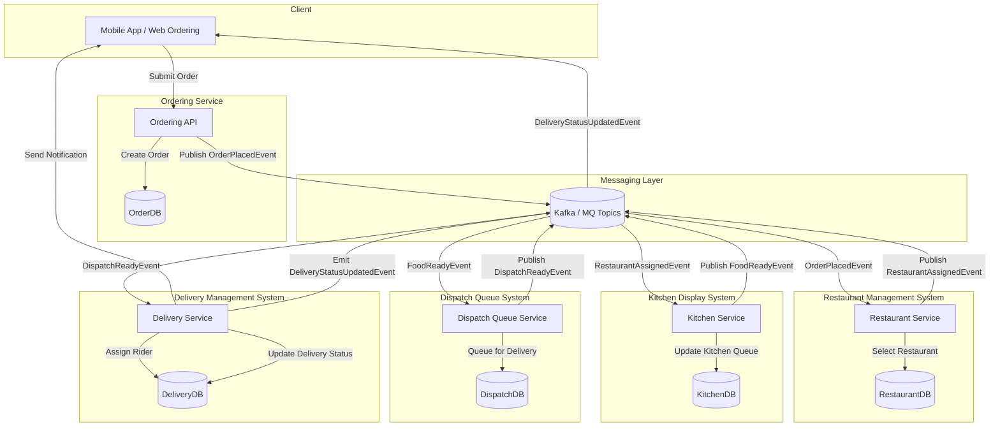

```mermaid
graph TD
  subgraph Client
    App[Mobile App / Web Ordering]
  end

  subgraph Ordering Service
    OrderAPI[Ordering API]
    OrderDB[(OrderDB)]
  end

  subgraph Restaurant Management System
    RMS[Restaurant Service]
    RMSDB[(RestaurantDB)]
  end

  subgraph Kitchen Display System
    KDS[Kitchen Service]
    KDSDB[(KitchenDB)]
  end

  subgraph Dispatch Queue System
    Dispatch[Dispatch Queue Service]
    DispatchDB[(DispatchDB)]
  end

  subgraph Delivery Management System
    DMS[Delivery Service]
    DeliveryDB[(DeliveryDB)]
  end

  subgraph Messaging Layer
    Kafka[(Kafka / MQ Topics)]
  end

  %% Ordering Flow
  App -->|Submit Order| OrderAPI
  OrderAPI -->|Create Order| OrderDB
  OrderAPI -->|Publish OrderPlacedEvent| Kafka

  %% Restaurant Assignment
  Kafka -->|OrderPlacedEvent| RMS
  RMS -->|Select Restaurant| RMSDB
  RMS -->|Publish RestaurantAssignedEvent| Kafka

  %% Kitchen Prep
  Kafka -->|RestaurantAssignedEvent| KDS
  KDS -->|Update Kitchen Queue| KDSDB
  KDS -->|Publish FoodReadyEvent| Kafka

  %% Dispatch Queue
  Kafka -->|FoodReadyEvent| Dispatch
  Dispatch -->|Queue for Delivery| DispatchDB
  Dispatch -->|Publish DispatchReadyEvent| Kafka

  %% Delivery Assignment
  Kafka -->|DispatchReadyEvent| DMS
  DMS -->|Assign Rider| DeliveryDB
  DMS -->|Send Notification| App

  %% Delivery Tracking
  DMS -->|Update Delivery Status| DeliveryDB
  DMS -->|Emit DeliveryStatusUpdatedEvent| Kafka
  Kafka -->|DeliveryStatusUpdatedEvent| App
```